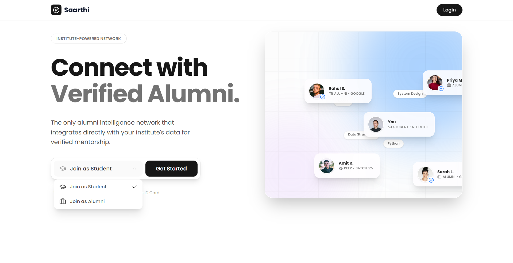
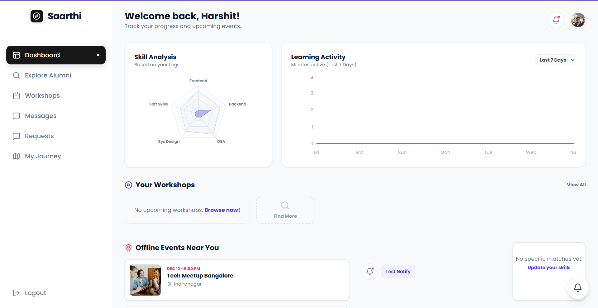
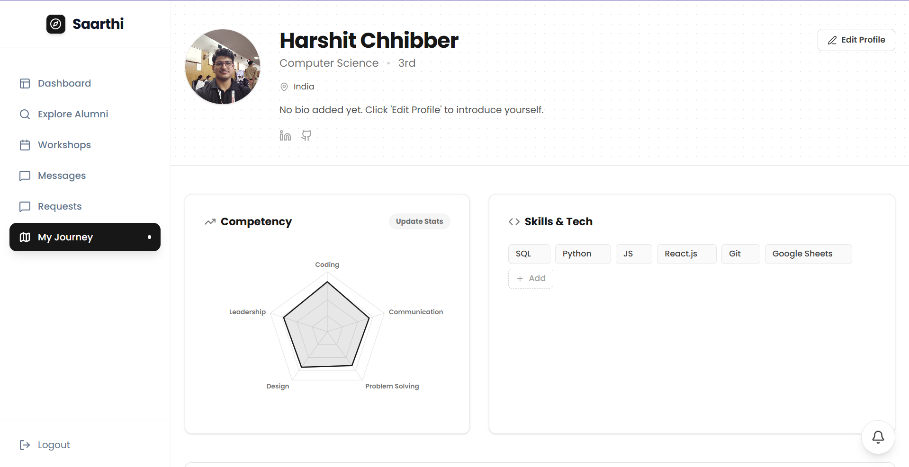
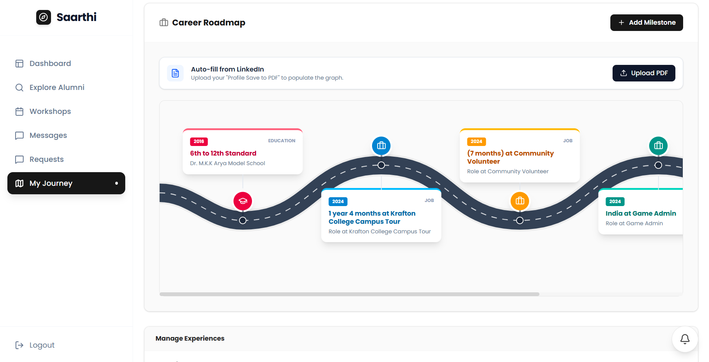
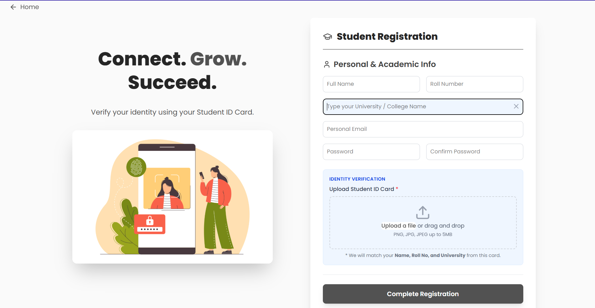
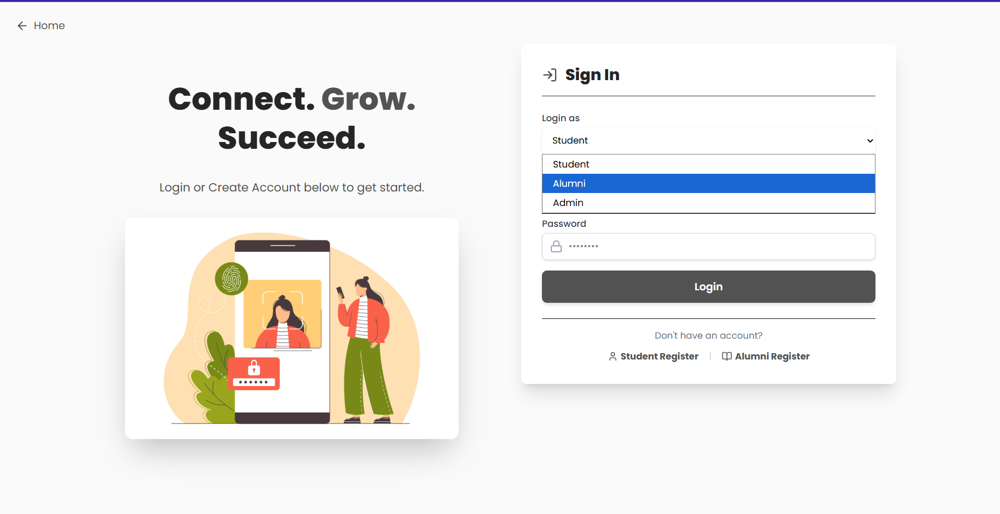

# Alumni Connect
Alumni Connect is a centralized platform that helps colleges manage alumni data and stay connected with their alumni, while enabling better interaction between alumni and students.

## Problem Statement
Lack of a centralized system for managing alumni data and engagement leads to poor communication and missed opportunities for mentorship and collaboration.

## 🎯 Impact
Improves alumni engagement, enables mentorship opportunities, and helps institutions maintain long-term relationships with graduates.

## Features
- Centralized alumni data management
- Student–alumni interaction
- AI-powered assistance
- Document verification (OCR)
- Role-based access system

## Tech Stack
- Frontend: React.js
- Backend: Node.js, Express.js
- Database: MongoDB

## Setup
- Clone the repository  
- Install dependencies:
   cd backend && npm install  
   cd frontend && npm install  
- Create a `.env` file using `.env.example`  
- Run backend and frontend:
   npm run dev

## 📸 Screenshots

### Landing Page

### Dashboard

### Profile

### Career Roadmap

### Authentication & Verification

